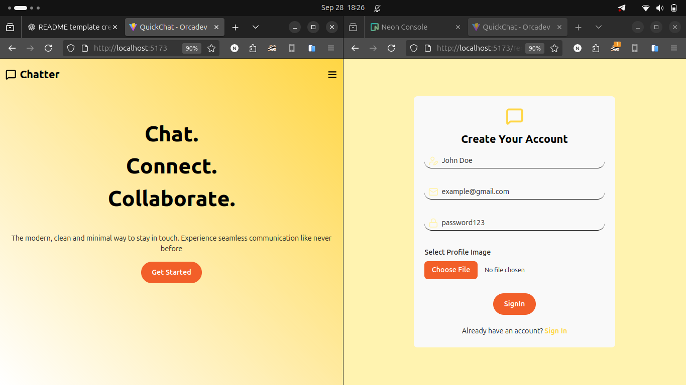
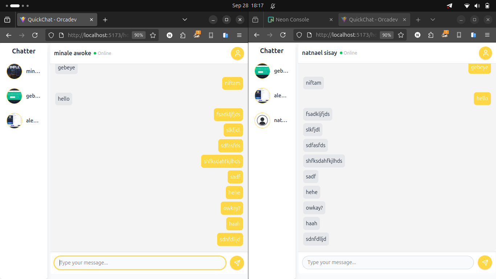

# Simple Chat App

A minimalistic real-time chat application built with **React**, **Node.js**, **TypeScript**, **Prisma**, **Zod**, **Zustand**, and **Socket.IO**.

This app focuses on simplicity: users get registered automatically, choose a chat, and start messaging instantly.

---

## Demo

### Home / Landing Page



### Chat Screen



---

## Features

- Real-time messaging with **Socket.IO**
- Simple and intuitive UI
- user registration and authorization with **JWT**
- Input validation with **Zod**
- State management using **Zustand**
- Built with **TypeScript** for type safety

---

## Tech Stack

- **Frontend:** React, TypeScript
- **Backend:** Node.js, Express, Socket.IO
- **Database:** Prisma (PostgreSQL)
- **Validation:** Zod
- **State Management:** Zustand

---

## Installation

1. Clone the repository:

```bash
git clone https://github.com/your-username/your-chat-app.git
cd chat-app
```
